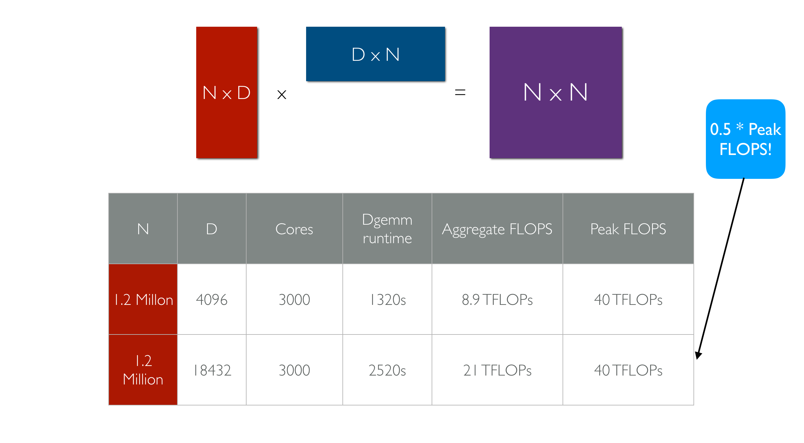
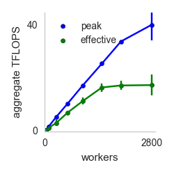
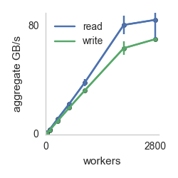
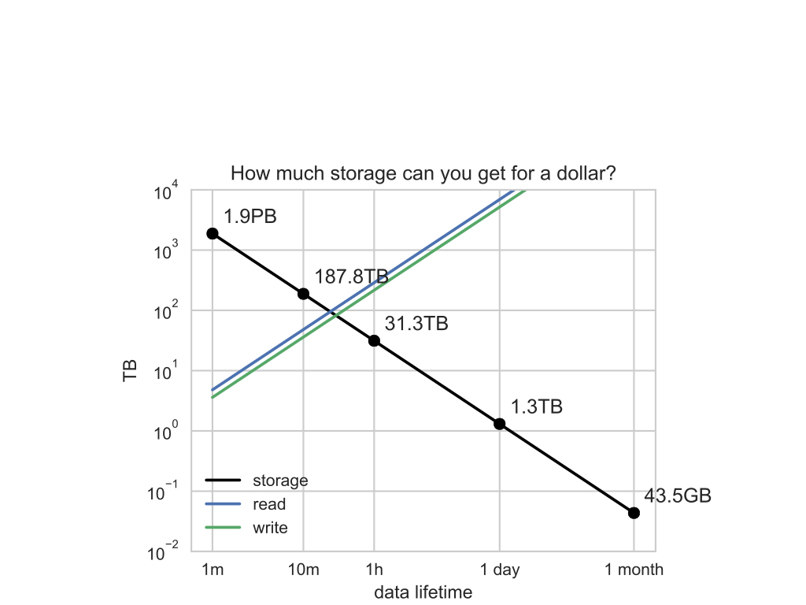
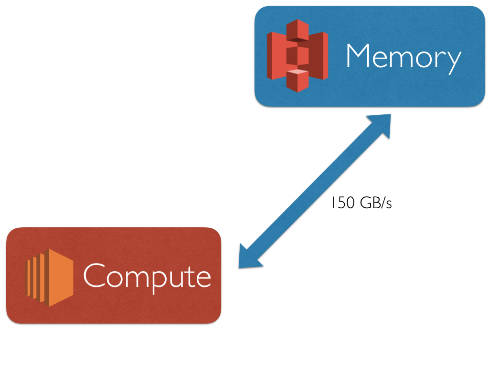
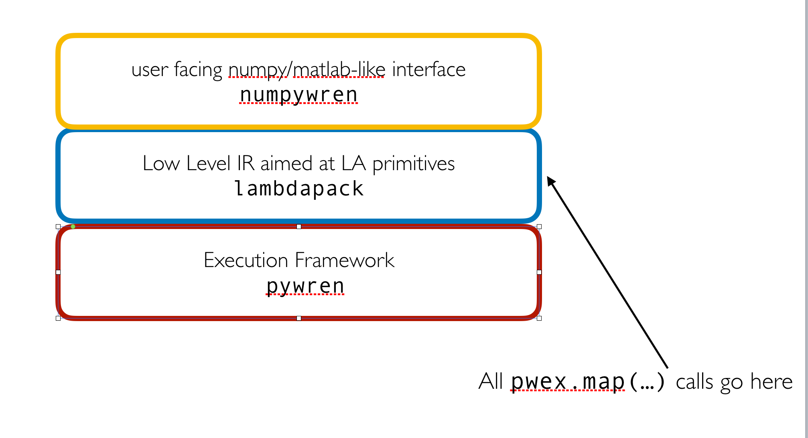
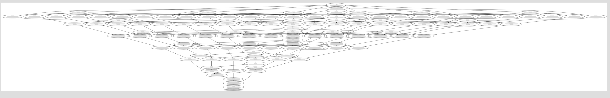

# numpywren
Scientific Computing with Infinite Ram


[](https://travis-ci.org/Vaishaal/numpywren)


## What is this?
numpywren is scientific computing framework built on top of the serverless execution framework [pywren](https://pywren.io).
numpywren forgoes the traditional mpi computational model for scientific computing workloads. Instead of dealing with individual
machines, host names, and processor grids numpywren works on the abstraction of "cores" and "memory". numpywren currently uses Amazon EC2 and Lambda services for
computation, and use Amazon S3 as a distributed memory abstraction. Even with this coarse abstraction, numpywren can achieve close to peak FLOPS and
network IO for difficult workloads such as matrix multiply and cholesky decomposition.



## A brief primer on pywren

Pywren is a stateless computation framework that leverages AWS Lambda to execute python functions remotely in parallel. A full description of the system can be found [here](https://arxiv.org/abs/1702.04024). Roughly it provides the following program model:

```
 def my_function(b):
    x = np.random.normal(0, b, 1024)
    A = np.random.normal(0, b, (1024, 1024))
    return np.dot(A, x)

  pwex = pywren.default_executor()
  res = pwex.map(my_function, range(3000))
```

```my_function``` from above is serialized and run on 1000 remote cores in an Amazon datacenter. Below is a plot of aggregate computational and IO throughput as the number of cores is increased.




 

Effective Flops refers to how long it takes for the functions to return to the host machine that started the invocation (which includes time taken by straggler cores). Peak Flops refers to the peak amount of flops achieved during the computation. The key takeaway is near linear scaling with number of workers for both IO and compute. The execution in the above example takes place on AWS Lambda invocations, but pywren provides a way to map the execution on EC2 instances.


## numpywren 

numpywren is designed to deal with *large* matrices by storing them on Amazon S3 instead of on ram on live EC2 instances. This has a couple advantages 

1. Cost effective. S3 charges $0.025/GB * Month. This is *very* cheap:



2. Decouples memory and computation for parallel algorithm design. Traditional parallel computational workloads utilize both the cores and memory on each machine, reasoning about where data lives often becomes cumbersome. 




### Design 

numpywren is currently designed to speed up computation when data can be efficiently represented as a sparse or dense matrix. numpywren employs the following design:



#### BigMatrix
BigMatrix  is numpywren's core data structure. Roughly speaking it breaks up a large numpy matrix into row and column blocks that are stored on S3, and provides fast access to said blocks.


```
class BigMatrix(object):
  """
    A multidimensional array stored in S3, sharded in blocks of a given size.
    Parameters
    ----------
    key : string
        The S3 key to store this matrix at.
    shape : tuple of int, optional
        Shape of the array. If set to None, the array with the given key
        must already exist in S3 with a valid header. 
    shard_sizes : tuple of int, optional
        Shape of the array blocks. If shape is not None this must be set,
        otherwise it will be ignored.
    bucket : string, optional
        Name of the S3 bucket where the matrix will be stored.
    prefix : string, optional
        Prefix that will be appended to the key name.
    dtype : data-type, optional
        Any object that can be interpreted as a numpy data type. Determines
        the type of the object stored in the array.
    transposed : bool, optional
        If transposed is True then the array object will behave like the
        transposed version of the underlying S3 object.
    parent_fn : function, optional
        A function that gets called when a previously uninitialized block is
        accessed. Gets passed the BigMatrix object and the relevant block index
        and is expected to appropriately initialize the given block.
    write_header : bool, optional
        If write_header is True then a header will be stored alongside the array
        to allow other BigMatrix objects to be initialized with the same key
        and underlying S3 representation.
    Notes
    -----
    BigMatrices deal with two types of indexing. Absolute and block indexing.
    Absolute indexing is simply the standard method of indexing arrays by their
    elements while block indexing accesses whole blocks.
    """
```

The public API consists solely of the following functions


    def get_block(self, *block_idx):
        """
        Given a block index, get the contents of the block.
        Parameters
        ----------
        block_idx : int or sequence of ints
            The index of the block to retrieve.
        Returns
        -------
        block : ndarray
            The block at the given index as a numpy array.
        """
        
     def put_block(self, block, *block_idx):
        """
        Given a block index, sets the contents of the block.
        Parameters
        ----------
        block : ndarray
            The array to set the block to.
        block_idx : int or sequence of ints
            The index of the block to set.
        Returns
        -------
        response : dict
            The response from S3 containing information on the status of
            the put request.
        Notes
        -----
        For details on the S3 response format see:
        http://boto3.readthedocs.io/en/latest/reference/services/s3.html#S3.Client.put_object
        """  
        
     def delete_block(self, *block_idx):
        """
        Delete the block at the given block index.
        Parameters
        ----------
        block_idx : int or sequence of ints
            The index of the block to delete.
        Returns
        -------
        response : dict
            The response from S3 containing information on the status of
            the delete request.
        Notes
        -----
        For details on the S3 response format see:
        http://boto3.readthedocs.io/en/latest/reference/services/s3.html#S3.Client.delete_object
        ""
   
    def numpy(self, workers=cpu_count):
        """
        Convert the BigMatrix to a local numpy array.
        Parameters
        ----------
        workers : int, optional
            The number of local workers to use when converting the array.
        Returns
        -------
        out : ndarray
            The numpy version of the BigMatrix object.
        """
        
    def free(self):
        """Delete all allocated blocks while leaving the matrix metadata intact.
        """ 
 
 
The BigMatrix python object carries no state of its own allowing it to easily be serialized and sent across the wire to remote function exections. numpywren passes these objects into ```pwex.map(...)``` calls 


#### numpywren.executor

numpywren.executor (or npwex) is the numpywren equivalent of pywren.executor (pwex), the pywren executor object. It wraps around the central execution state. It exposes userfacing numpy-like functions. Under the hood it calls internal lambdapack implementations of various algorithms 

*TODO: This functionality is not yet implemented*


#### lambdapack

lambdapack is the IR which underlying numpywren algorithms. It has an assembly-like syntax with a few quirks. The high level idea behind lambdapack code is that it treats S3 like memory, and local instance memory as registers. l Furthermore lambdapack programs have the following restrictions:

* lambdapack programs have no control flow or looping mechanism. lambdapack is **not** turing complete. Instead it is designed to be a linearly executable sequence of instructions. 
* lambdapack programs have size O(runtime). The input matrix must be blocked accordingly to make these programs tractable.
* ```BigMatrix.put_block(X, i, j)``` can only be called once for a particular tuple (X, i, j). Within a lambdapack program matrices cannot be mutated.

These restrictions (especially the last) makes lambdapack programs naturally SSA (static single assignment). This allows for easy dependency analysis of the program to build a DAG (directed acylic graph) that can be executed in parallel.

Below is a simple lambdapack program to compute a block 2 x 2 cholesky decomposition. 

```
local
        0 = S3_LOAD BigSymmetricMatrix(cholesky_test_A) 2
        1 = CHOL 0
        2 = INVRS 1
        3 = S3_WRITE BigMatrix(chol(BigSymmetricMatrix(cholesky_test_A))) 2 0 0 1
        4 = S3_WRITE BigMatrix(chol(BigSymmetricMatrix(cholesky_test_A))_(0,0)_inv) 2 0 0 2
        20 = RET <numpywren.lambdapack.RemoteProgramState object at 0x7fad8c0e3ac8>

parallel_block_0_job_0
        5 = S3_LOAD BigSymmetricMatrix(cholesky_test_A) 2
        6 = S3_LOAD BigMatrix(chol(BigSymmetricMatrix(cholesky_test_A))_(0,0)_inv) 2
        7 = TRSM 5 6
        8 = S3_WRITE BigMatrix(chol(BigSymmetricMatrix(cholesky_test_A))) 2 1 0 7
        20 = RET <numpywren.lambdapack.RemoteProgramState object at 0x7fad8c0e3da0>

parallel_block_1_job_0
        9 = S3_LOAD BigSymmetricMatrix(cholesky_test_A) 2
        10 = S3_LOAD BigMatrix(chol(BigSymmetricMatrix(cholesky_test_A))) 2
        11 = S3_LOAD BigMatrix(chol(BigSymmetricMatrix(cholesky_test_A))) 2
        12 = SYRK 9 10 11
        13 = S3_WRITE BigMatrix(chol(BigSymmetricMatrix(cholesky_test_A))_0_trailing) 2 1 1 12
        20 = RET <numpywren.lambdapack.RemoteProgramState object at 0x7fad8c0e3d30>

local
        14 = S3_LOAD BigMatrix(chol(BigSymmetricMatrix(cholesky_test_A))_0_trailing) 2
        15 = CHOL 14
        16 = INVRS 15
        17 = S3_WRITE BigMatrix(chol(BigSymmetricMatrix(cholesky_test_A))) 2 1 1 15
        18 = S3_WRITE BigMatrix(chol(BigSymmetricMatrix(cholesky_test_A))_(1,1)_inv) 2 0 0 16
        20 = RET <numpywren.lambdapack.RemoteProgramState object at 0x7fad8c0e35f8>

EXIT
        19 = RET <numpywren.lambdapack.RemoteProgramState object at 0x7fac78f02ac8>
        
```

Below is the dependency graph for the above program:


Its evident that there is no parallelism to exploit in this graph, but thats because a 2 x 2 block cholesky decomposition emits almost no parallelism. Lets try the same thing with a 8 x 8 block cholesky decomposition. I won't paste the resulting lambdapack source. But here is a very zoomed out overhead glimpse of the execution DAG:



The width of the DAG roughly corresponds to the amount of parallelism. numpywren passes the full execution dag along with every function execution, such that a job can be immediately scheduled the moment all of its parents have finished execution. Doing this requires an atomic increment primitive (the current implementation hacks Amazon DynamoDB for said purpose).


TODOs:

* Implement more lambdapack operations currently only a few primitive ones required for DGEMM and Cholesky are provided.
* Hit peak FLOPS for Cholesky decomposition
* Implement more algorithms on top of lambdapack (currently only DGEMM and Cholesky are supported)
* Improve performance instrumentation
* Much much more.


